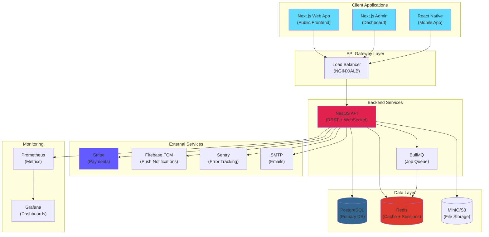
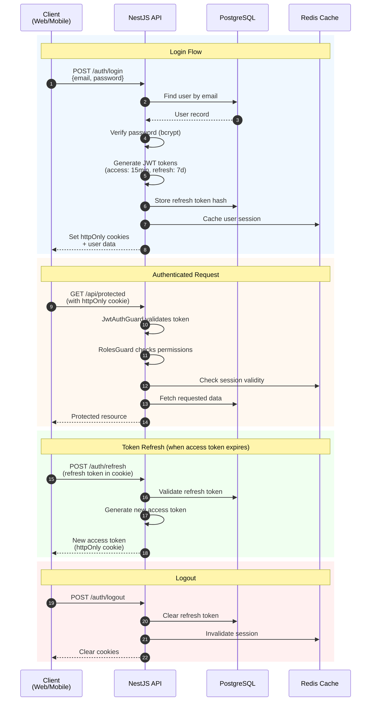
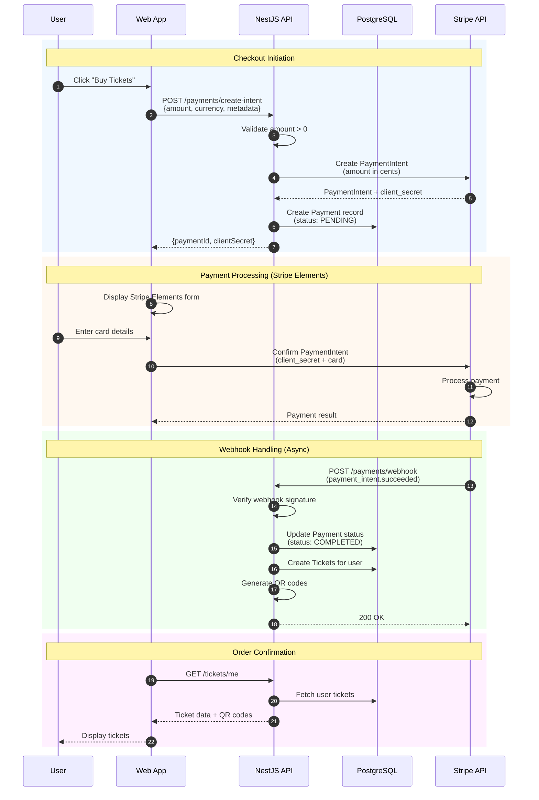
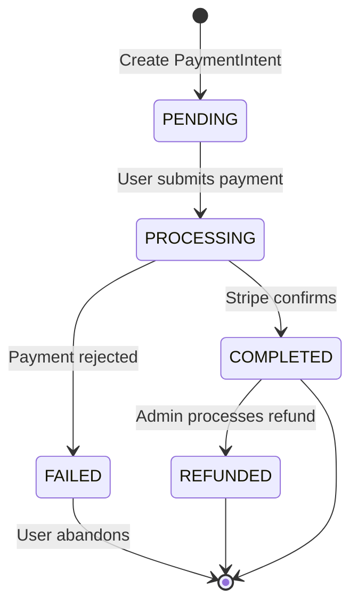
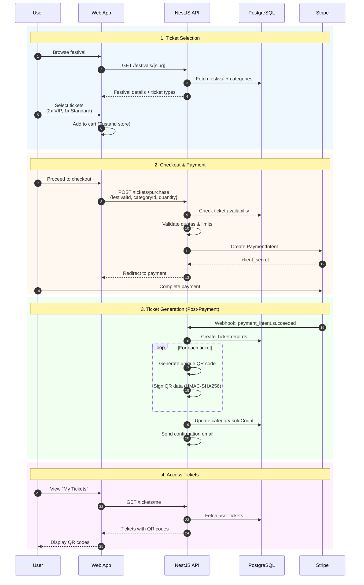
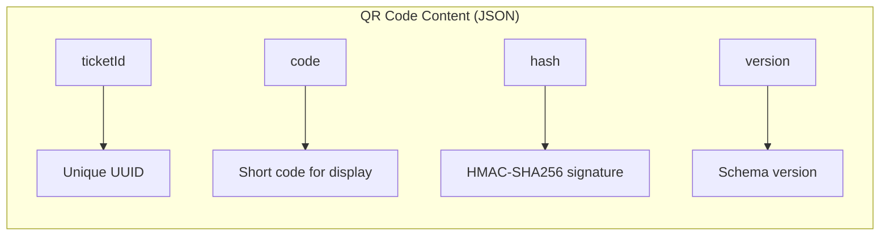
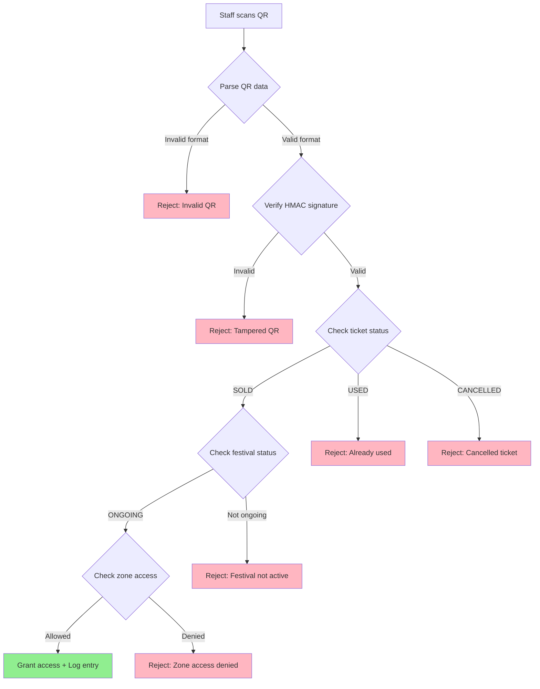
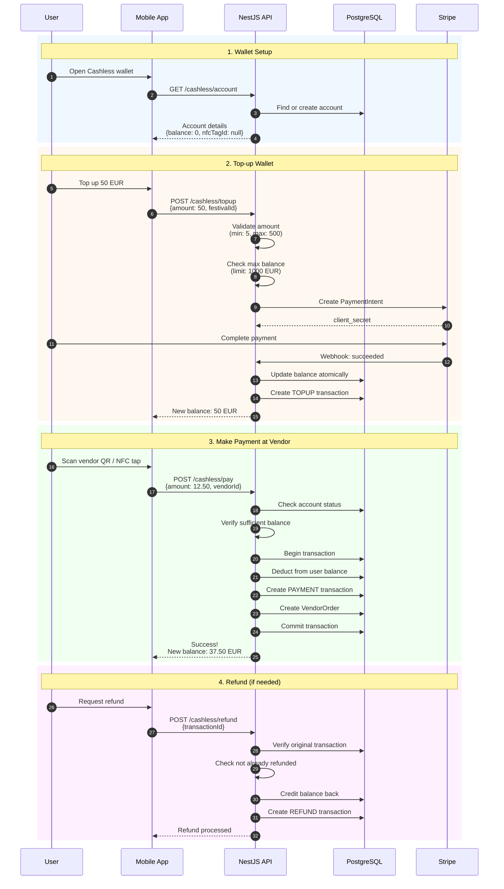
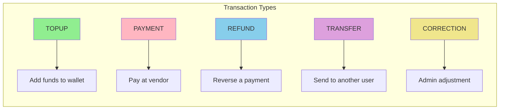
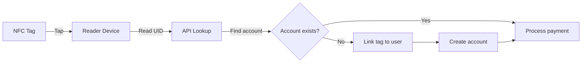

# Architecture Documentation - Festival Management Platform

This document provides comprehensive architecture documentation with visual diagrams for the Festival Management Platform. Designed for new developers to quickly understand the system.

## Table of Contents

1. [System Overview](#1-system-overview)
2. [Authentication Flow](#2-authentication-flow)
3. [Payment Flow](#3-payment-flow)
4. [Ticket Purchase Flow](#4-ticket-purchase-flow)
5. [Cashless Payment Flow](#5-cashless-payment-flow)
6. [Data Model](#6-data-model)
7. [Tech Stack Summary](#7-tech-stack-summary)

---

## 1. System Overview

High-level architecture showing how all components interact.



### Component Descriptions

| Component           | Technology   | Purpose                                       |
| ------------------- | ------------ | --------------------------------------------- |
| **Web App**         | Next.js 15   | Public-facing website for festival-goers      |
| **Admin Dashboard** | Next.js 15   | Management interface for organizers           |
| **Mobile App**      | React Native | Native mobile experience with offline support |
| **API**             | NestJS 10    | Core backend with REST API + WebSocket        |
| **PostgreSQL**      | v16          | Primary relational database                   |
| **Redis**           | v7           | Caching, sessions, job queues                 |
| **Stripe**          | API          | Payment processing                            |

---

## 2. Authentication Flow

JWT-based authentication with httpOnly cookies for security.



### Token Configuration

| Token Type             | Duration   | Storage                   | Purpose              |
| ---------------------- | ---------- | ------------------------- | -------------------- |
| **Access Token**       | 15 minutes | httpOnly cookie           | API authentication   |
| **Refresh Token**      | 7 days     | httpOnly cookie + DB hash | Token renewal        |
| **Email Verification** | 24 hours   | Database                  | Account verification |
| **Password Reset**     | 1 hour     | Database (SHA-256 hash)   | Password recovery    |

### Security Features

- **httpOnly Cookies**: Prevents XSS token theft
- **Secure Flag**: HTTPS only in production
- **SameSite=Strict**: CSRF protection
- **Token Rotation**: Refresh tokens are rotated on use
- **Password Hashing**: bcrypt with 12 salt rounds

---

## 3. Payment Flow

Stripe Checkout integration with webhook handling.



### Webhook Events Handled

| Event                           | Action                                                   |
| ------------------------------- | -------------------------------------------------------- |
| `payment_intent.succeeded`      | Update payment status, create tickets, generate QR codes |
| `payment_intent.payment_failed` | Update payment status to FAILED, notify user             |
| `charge.refunded`               | Process refund, update ticket status                     |
| `charge.dispute.created`        | Flag payment, notify admin                               |

### Payment States



---

## 4. Ticket Purchase Flow

End-to-end ticket purchase from selection to QR code generation.



### QR Code Structure



**QR Code Security:**

- Signed with HMAC-SHA256 using server secret (min 32 chars)
- Contains ticket ID, short code, and cryptographic hash
- Validated server-side on scan
- Single-use protection (status changes to USED)

### Ticket Validation at Entry



---

## 5. Cashless Payment Flow

NFC-based cashless wallet system for in-festival purchases.



### Cashless Configuration

| Setting         | Value        | Description            |
| --------------- | ------------ | ---------------------- |
| **MIN_TOPUP**   | 5.00 EUR     | Minimum top-up amount  |
| **MAX_TOPUP**   | 500.00 EUR   | Maximum single top-up  |
| **MAX_BALANCE** | 1,000.00 EUR | Maximum wallet balance |
| **MIN_PAYMENT** | 0.01 EUR     | Minimum payment amount |

### Transaction Types



### NFC Flow



---

## 6. Data Model

Simplified Entity-Relationship diagram of core entities.

```mermaid
erDiagram
    USER ||--o{ TICKET : purchases
    USER ||--o| CASHLESS_ACCOUNT : has
    USER ||--o{ PAYMENT : makes
    USER ||--o{ NOTIFICATION : receives
    USER ||--o{ SUPPORT_TICKET : creates

    FESTIVAL ||--o{ TICKET_CATEGORY : has
    FESTIVAL ||--o{ TICKET : sells
    FESTIVAL ||--o{ ZONE : contains
    FESTIVAL ||--o{ STAGE : has
    FESTIVAL ||--o{ VENDOR : hosts
    FESTIVAL ||--o{ CAMPING_ZONE : provides

    TICKET_CATEGORY ||--o{ TICKET : generates

    TICKET ||--o{ ZONE_ACCESS_LOG : logs

    PAYMENT ||--o{ TICKET : funds
    PAYMENT ||--o| CASHLESS_TRANSACTION : triggers

    CASHLESS_ACCOUNT ||--o{ CASHLESS_TRANSACTION : records

    STAGE ||--o{ PERFORMANCE : schedules
    ARTIST ||--o{ PERFORMANCE : performs

    VENDOR ||--o{ VENDOR_PRODUCT : sells
    VENDOR ||--o{ VENDOR_ORDER : receives

    CAMPING_ZONE ||--o{ CAMPING_SPOT : contains
    CAMPING_SPOT ||--o{ CAMPING_BOOKING : booked

    USER {
        uuid id PK
        string email UK
        string passwordHash
        string firstName
        string lastName
        enum role "ADMIN|ORGANIZER|STAFF|CASHIER|SECURITY|USER"
        enum status "ACTIVE|INACTIVE|BANNED|PENDING_VERIFICATION"
        boolean emailVerified
        datetime lastLoginAt
    }

    FESTIVAL {
        uuid id PK
        uuid organizerId FK
        string name
        string slug UK
        string location
        datetime startDate
        datetime endDate
        enum status "DRAFT|PUBLISHED|ONGOING|COMPLETED|CANCELLED"
        int maxCapacity
        int currentAttendees
    }

    TICKET {
        uuid id PK
        uuid festivalId FK
        uuid categoryId FK
        uuid userId FK
        string qrCode UK
        enum status "AVAILABLE|RESERVED|SOLD|USED|CANCELLED|REFUNDED"
        decimal purchasePrice
        datetime usedAt
    }

    TICKET_CATEGORY {
        uuid id PK
        uuid festivalId FK
        string name
        enum type "STANDARD|VIP|BACKSTAGE|CAMPING|PARKING|COMBO"
        decimal price
        int quota
        int soldCount
    }

    PAYMENT {
        uuid id PK
        uuid userId FK
        decimal amount
        string currency
        enum status "PENDING|PROCESSING|COMPLETED|FAILED|REFUNDED"
        enum provider "STRIPE|PAYPAL|BANK_TRANSFER|CASH"
        string providerPaymentId
    }

    CASHLESS_ACCOUNT {
        uuid id PK
        uuid userId FK UK
        decimal balance
        string nfcTagId UK
        boolean isActive
    }

    CASHLESS_TRANSACTION {
        uuid id PK
        uuid accountId FK
        uuid festivalId FK
        enum type "TOPUP|PAYMENT|REFUND|TRANSFER|CORRECTION"
        decimal amount
        decimal balanceBefore
        decimal balanceAfter
    }

    ZONE {
        uuid id PK
        uuid festivalId FK
        string name
        int capacity
        int currentOccupancy
    }

    VENDOR {
        uuid id PK
        uuid festivalId FK
        string name
        enum type "FOOD|DRINK|BAR|MERCHANDISE"
        decimal commissionRate
    }

    STAGE {
        uuid id PK
        uuid festivalId FK
        string name
        int capacity
    }

    ARTIST {
        uuid id PK
        string name
        string genre
    }

    PERFORMANCE {
        uuid id PK
        uuid artistId FK
        uuid stageId FK
        datetime startTime
        datetime endTime
    }
```

### Key Relationships

| Relationship                   | Description                           |
| ------------------------------ | ------------------------------------- |
| User -> Tickets                | One user can purchase many tickets    |
| User -> CashlessAccount        | One-to-one relationship               |
| Festival -> TicketCategories   | Festival defines ticket types         |
| Payment -> Tickets             | One payment can fund multiple tickets |
| CashlessTransaction -> Payment | Top-ups linked to payments            |

### Database Indexes

Critical indexes for performance:

```sql
-- Ticket queries
@@index([festivalId, status])           -- Analytics by festival
@@index([festivalId, categoryId])       -- Reports by category
@@index([userId, status])               -- User's tickets

-- Cashless queries
@@index([festivalId, type, createdAt])  -- Transaction analytics
@@index([accountId, createdAt])         -- User history

-- Payment queries
@@index([userId, status])               -- User payment history
@@index([provider, status])             -- Provider analysis
```

---

## 7. Tech Stack Summary

### Backend

| Component | Technology | Version |
| --------- | ---------- | ------- |
| Runtime   | Node.js    | 20 LTS  |
| Framework | NestJS     | 10.x    |
| ORM       | Prisma     | 5.x     |
| Database  | PostgreSQL | 16      |
| Cache     | Redis      | 7       |
| Queue     | BullMQ     | 5.x     |
| WebSocket | Socket.io  | 4.x     |

### Frontend

| Component  | Technology      | Version |
| ---------- | --------------- | ------- |
| Framework  | Next.js         | 15.x    |
| UI Library | React           | 19.x    |
| Styling    | Tailwind CSS    | 3.x     |
| State      | Zustand         | 4.x     |
| Forms      | React Hook Form | 7.x     |
| i18n       | next-intl       | 3.x     |

### Mobile

| Component  | Technology       | Version |
| ---------- | ---------------- | ------- |
| Framework  | React Native     | 0.73.x  |
| Navigation | React Navigation | 6.x     |
| Storage    | AsyncStorage     | 1.x     |
| Push       | Firebase FCM     | -       |

### Infrastructure

| Component        | Technology           |
| ---------------- | -------------------- |
| Containerization | Docker               |
| Orchestration    | Kubernetes           |
| CI/CD            | GitHub Actions       |
| Monitoring       | Prometheus + Grafana |
| Logging          | Pino + Sentry        |
| CDN/WAF          | Cloudflare           |

---

## Additional Resources

- [API Guide](./api/API_GUIDE.md) - Complete API documentation
- [Webhooks](./api/WEBHOOKS.md) - Webhook integration guide
- [Security](./security/GDPR_AUDIT.md) - GDPR compliance documentation
- [Deployment](./DEPLOYMENT.md) - Deployment instructions

---

_Last updated: January 2026_
